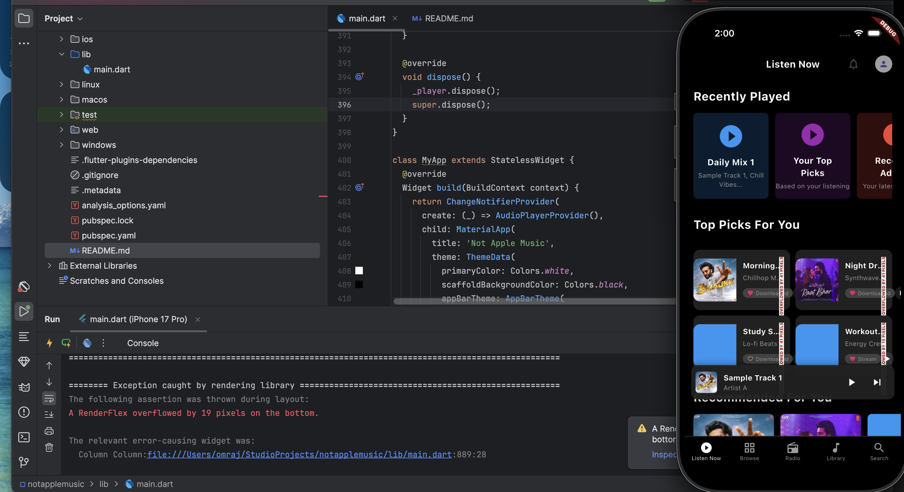
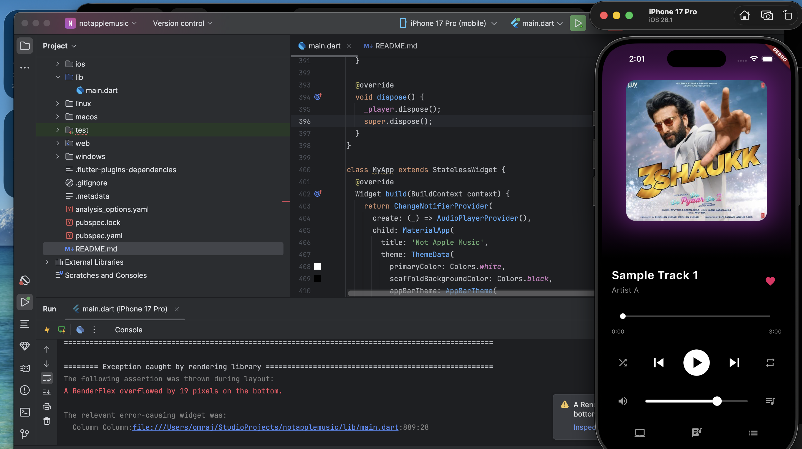
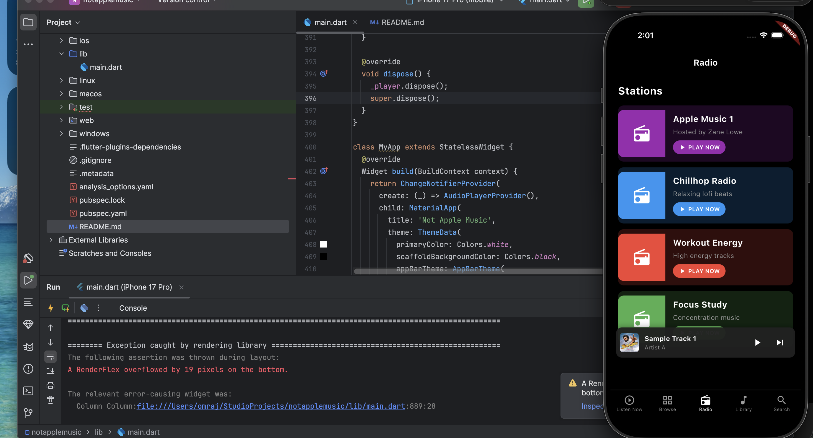
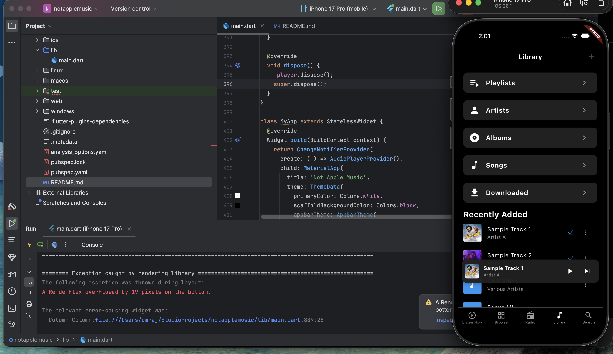
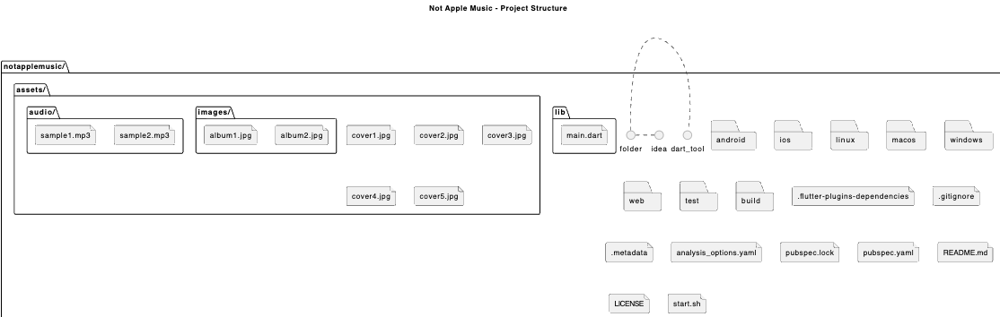
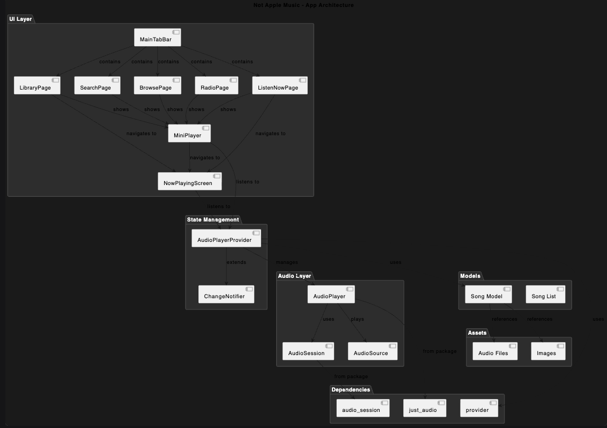
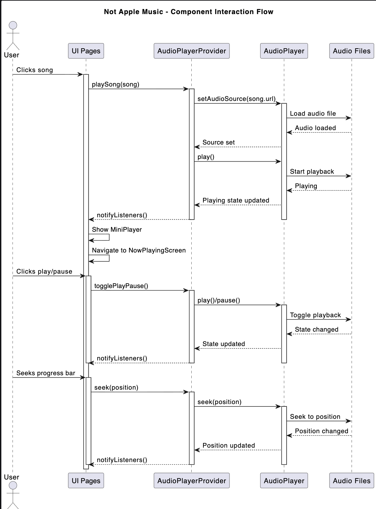

# Not Apple Music 🎵

A Flutter music player app with Apple Music-inspired UI, featuring a beautiful dark theme, smooth animations, and full audio playback functionality.


## Features ✨

- **Apple Music UI Clone**: Faithful recreation of Apple Music's design
- **5-Tab Navigation**: Listen Now, Browse, Radio, Library, Search
- **Audio Playback**: Full-featured audio player with play/pause, next/previous, shuffle, repeat
- **Mini Player**: Always-available mini player at the bottom
- **Now Playing Screen**: Full-screen player with progress bar and controls
- **Dark Theme**: Apple Music's signature dark theme with gradient effects
- **Responsive Design**: Works on mobile, tablet, and desktop


## Screenshots 




## Project Structure 🏗️
notapplemusic/
├── .dart_tool/
├── .idea/
├── android/
├── assets/
│   ├── audio/
│   │   ├── sample1.mp3
│   │   └── sample2.mp3
│   └── images/
│       ├── album1.jpg
│       └── album2.jpg
├── build/
├── ios/
├── lib/
│   └── main.dart
├── linux/
├── macos/
├── test/
├── web/
├── windows/
├── .flutter-plugins-dependencies
├── .gitignore
├── .metadata
├── analysis_options.yaml
├── pubspec.lock
├── pubspec.yaml
└── README.md


## Getting Started 🚀

### Prerequisites

- Flutter SDK (3.0.0 or higher)
- Dart SDK (3.0.0 or higher)
- Android Studio/VSCode with Flutter extension

### Installation

1. **Clone the repository**
   ```bash
   git clone https://github.com/yourusername/notapplemusic.git
   cd notapplemusic

Install dependencies

bash
flutter pub get

Run the app

bash
# For web
flutter run -d chrome

# For Android
flutter run -d android

# For iOS
flutter run -d ios

# For macOS
flutter run -d macos

Features in Detail 📖
🎵 Audio Player
Play/Pause controls

Next/Previous track navigation

10-second forward/backward skip

Shuffle and repeat modes

Volume control

Progress bar with seeking

🎨 UI Components
Listen Now: Top picks and recently played

Browse: Music categories and featured playlists

Radio: Music stations with play buttons

Library: Organized music collection

Search: Music search with categories

Mini Player: Compact player at bottom

Now Playing: Full-screen player experience

🎯 Technical Features
Provider state management

Just Audio for audio playback

Custom scroll views with slivers

Gradient backgrounds

Responsive grid layouts

Smooth animations

Dependencies 📦
Package	Version	Purpose
just_audio	^0.9.35	Audio playback
provider	^6.1.0	State management
audio_session	^0.1.20	Audio session management
Customization 🎨
Adding More Songs
Add songs to the librarySongs list in lib/main.dart:

dart
Song(
  id: '6',
  title: 'Your Song Title',
  artist: 'Artist Name',
  album: 'Album Name',
  art: 'assets/images/your-image.jpg',
  url: 'assets/audio/your-audio.mp3',
  duration: Duration(minutes: 3, seconds: 30),
  isExplicit: false,
  isDownloaded: true,
  isLiked: false,
),
Changing Colors
Modify the theme in MyApp class:

dart
theme: ThemeData(
  primaryColor: Colors.white,
  scaffoldBackgroundColor: Colors.black,
  // ... other theme properties
),
Adding Categories
Update the browseCategories list:

dart
{'title': 'New Category', 'color': Colors.cyan, 'icon': Icons.new_releases},
Supported Platforms 🌍
✅ Android

✅ iOS

✅ Web

✅ macOS

✅ Linux

✅ Windows

Contributing 🤝
Fork the repository

Create a feature branch

Commit your changes

Push to the branch

Open a Pull Request

Future Enhancements 🚀
Playlist creation and management

Lyrics display

Equalizer settings

Offline download support

User authentication

Music streaming integration

Cross-device sync

License 📄
This project is licensed under the MIT License - see the LICENSE file for details.

Acknowledgments 🙏
Apple Music for UI inspiration

Flutter team for amazing framework

Just Audio package developers

SoundHelix for sample audio



##Project Structure Diagram



##App Architecture Diagram



##ComponentFlowDiagram















